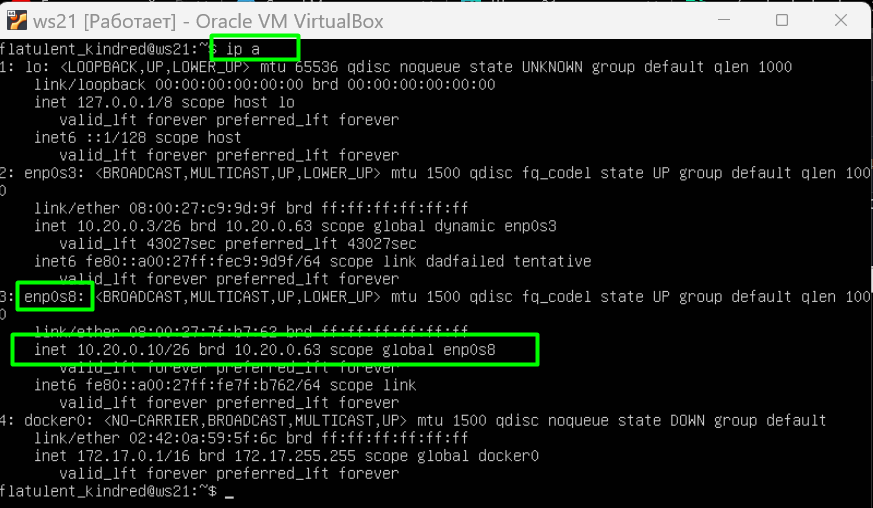

# Cети в Linux

Настройка сетей в Linux на виртуальных машинах.


## Contents

1. [Инструмент ipcalc](#part-1-инструмент-ipcalc)
2. [Статическая маршрутизация между двумя машинами](#part-2-статическая-маршрутизация-между-двумя-машинами)
3. [Утилита iperf3](#part-3-утилита-iperf3)
4. [Сетевой экран](#part-4-сетевой-экран)
5. [Статическая маршрутизация сети](#part-5-статическая-маршрутизация-сети)
6. [Динамическая настройка IP с помощью DHCP](#part-6-динамическая-настройка-ip-с-помощью-dhcp)
7. [NAT](#part-7-nat)
8. [Допополнительно. Знакомство с SSH Tunnels](#part-8-дополнительно-знакомство-с-ssh-tunnels)

## Part 1. Инструмент ipcalc
- **1.1 Сети и маски**

Поднять виртуальную машину (далее -- ws1);

 Определить и записать в отчёт:
    
    1) Адрес сети 192.167.38.54/13: 192.160.0.0

    2) Перевод масок в двоичную, префиксную и обычную запись
        
        255.255.255.0: /24 - префиксная запись, 11111111.11111111.11111111.00000000 - двоичная запись
        
        /15: 11111111.11111110.00000000.00000000 - двоичная, 255.254.0.0 - обычная запись

    3) Максимальный и минимальный хост в сети 12.167.38.4 при при масках:
      */8*
      HostMin:  12.0.0.1          00001100.00000000.00000000.00000001
      HostMax:  12.255.255.254    00001100.11111111.11111111.11111110

      *11111111.11111111.00000000.00000000*
      HostMin:  12.167.0.1        00001100.10100111.00000000.00000001
      HostMax:  12.167.255.254    00001100.10100111.11111111.11111110

      *255.255.254.0*
      HostMin:  12.167.38.1       00001100.10100111.00100110.00000001
      HostMax:  12.167.39.254     00001100.10100111.00100111.11111110

      */4*
      HostMin:	0.0.0.1	    00000000.00000000.00000000.00000001
      HostMax:	15.255.255.254  00001111.11111111.11111111.11111110
    


 **1.2 Localhost**

      194.34.23.100 - No
      127.0.0.2 - Yes
      127.1.0.1 - Yes
      128.0.0.1 - No

 **1.3. Диапазоны и сегменты сетей**

Определить и записать в отчёт:
##### 1) какие из перечисленных IP можно использовать в качестве публичного, а какие только в качестве частных:
        10.0.0.45 - private
        134.43.0.2 - public  
        192.168.4.2 - private
        172.20.250.4 - private
        172.0.2.1 - public 
        192.172.0.1 - public  
        172.68.0.2 - public  
        172.16.255.255 - private
        10.10.10.10 - private
        192.169.168.1 - public

##### 2) какие из перечисленных IP адресов шлюза возможны у сети *10.10.0.0/18*:
        10.0.0.1 - no
        10.10.0.2 - yes
        10.10.10.10 - yes
        10.10.100.1 - no
        10.10.1.255 - yes

## Part 2. Статическая маршрутизация между двумя машинами

##### Поднять две виртуальные машины (далее -- w1 и w2)
  

##### С помощью команды `ip a` посмотреть существующие сетевые интерфейсы

    w1


    w2


##### Описать сетевой интерфейс, соответствующий внутренней сети, на обеих машинах и задать следующие адреса и маски: w1 - *192.168.100.10*, маска */16*, w2 - *172.24.116.8*, маска */12*


##### Выполнить команду `netplan apply` для перезапуска сервиса сети


#### 2.1. Добавление статического маршрута вручную
##### Добавить статический маршрут от одной машины до другой и обратно при помощи команды вида `ip r add`


##### Пропинговать соединение между машинами


### 2.2. Добавление статического маршрута с сохранением
##### Перезапустить машины
##### Добавить статический маршрут от одной машины до другой с помощью файла *etc/netplan/00-installer-config.yaml*


##### Пропинговать соединение между машинами


## Part 3. Утилита **iperf3**
Для установки выполнила:      
 - sudo apt install iperf3
 К сожалению, подключиться к интернету не удалось.
 
 Включила второй интерфейс, чтобы иметь возможность настроить Интернет.
 
 Включила DHCP для второго интерфейса в сетевом плане. sudo nano /etc/netplan/00-interface-config.yaml
 

Для того, чтобы убедиться, что соединение установлено пигую 8.8.8.8:
 

Для установки повторно выполнила команду sudo apt install iperf3 на обеих машинах. Установка завершилась успешно.

#### 3.1. Скорость соединения
##### Перевести и записать в отчёт: 8 Mbps в MB/s, 100 MB/s в Kbps, 1 Gbps в Mbps
Бит в секунду, бит/с (англ. bits per second, bps) — базовая единица измерения скорости передачи информации, используемая на физическом уровне сетевой модели OSI или TCP/IP.  
На более высоких уровнях сетевых моделей, как правило, используется более крупная единица — байт в секунду (Б/c или Bps, от англ. bytes per second) равная 8 бит/c.     
Для обозначения больших скоростей передачи применяют более крупные единицы, образованные с помощью приставок системы СИ кило-, мега-, гига- и т. п. получая:      
килобиты в секунду — кбит/с (kbps, kbit/s или kb/s)   
мегабиты в секунду — Мбит/с (Mbps, Mbit/s или Mb/s)   
гигабиты в секунду — Гбит/с (Gbps, Gbit/s или Gb/s)   
Часто путают Mb/s и MB/s (1 MB/s = 8 Mb/s), поэтому рекомендуется использовать сокращение Mbit/s      


      8 Мегабит в секунду =  1 Мегабайт в секунду

      100 Мегабайт в секунду =  819200 Килобит в секунду

      1 Гигабит в секунду =  1024 Мегабит в секунду

#### 3.2. Утилита **iperf3**
##### Измерить скорость соединения между ws1 и ws2


## Part 4. Сетевой экран

#### 4.1. Утилита **iptables**
##### Создать файл */etc/firewall.sh*, имитирующий фаерволл, на ws1 и ws2:
```shell
#!/bin/sh

# Удаление всех правил в таблице "filter" (по-умолчанию).
iptables –F
iptables -X
```


##### Нужно добавить в файл подряд следующие правила:
##### 1) на ws1 применить стратегию когда в начале пишется запрещающее правило, а в конце пишется разрешающее правило (это касается пунктов 4 и 5)
##### 2) на ws2 применить стратегию когда в начале пишется разрешающее правило, а в конце пишется запрещающее правило (это касается пунктов 4 и 5)
##### 3) открыть на машинах доступ для порта 22 (ssh) и порта 80 (http)
##### 4) запретить *echo reply* (машина не должна "пинговаться”)
##### 5) разрешить *echo reply* (машина должна "пинговаться")


##### Запустить файлы на обеих машинах командами `chmod +x /etc/firewall.sh` и `/etc/firewall.sh`
    sudo chmod +x /etc/firewall.sh
    sudo /etc/firewall.sh
    ping -c 5 8.8.8.8, чтобы добавить передачу данных
    вывод списка созданных правил: sudo iptables -L


Разница между стратегиями - будет выполнено первое подходящее правило. Правила, которые применяются после, будут игнорироваться.

#### 4.2. Утилита **nmap**
##### Командой **ping** найти машину, которая не "пингуется", после чего утилитой **nmap** показать, что хост машины запущен

Используйте команду ping, чтобы найти машину, которая не пингуется, затем используйте утилиту nmap, чтобы показать, что хост машины работает. Проверьте: вывод nmap должен сказать: Host is up.

установка nmap — sudo apt-get install nmap


## Part 5. Статическая маршрутизация сети
- Сеть:


- Запускаем пять виртуальных машин (3 рабочие станции (ws11, ws21, ws22) и 2 роутера (r1, r2)):


### 5.1. Настройка адресов машин
##### Настроить конфигурации машин в *etc/netplan/00-installer-config.yaml* согласно сети на рисунке выше.

- Добавьте в отчет скриншоты файла etc/netplan/00-installer-config.yaml для каждой машины.


- Перезапустите сетевую службу

- Проверка с помощью команды `ip -4 a`


проверка связи ws22 с ws21 и r1 с ws11


### 5.2. Включение переадресации IP-адресов.

##### Для включения переадресации IP, выполнила команду на роутерах: 

- `sysctl -w net.ipv4.ip_forward=1`


- В файле `/etc/sysctl.conf` добавляем следующую строку:
`net.ipv4.ip_forward = 1`


### 5.3. Установка маршрута по-умолчанию
- Настройте маршрут по умолчанию (шлюз) для рабочих станций. Для этого перед IP роутера в конфигурационном файле добавить default

- Добавьте в отчет скриншот файла etc/netplan/00-installer-config.yaml.

Пример вывода команды `ip r` после добавления шлюза:
```
default via 10.10.0.1 dev eth0
10.10.0.0/18 dev eth0 proto kernel scope link src 10.10.0.2
```
 

 

 

 

 

--------------------------------------------------------------------------

- Вызвать ip r и показать, что маршрут добавлен в таблицу маршрутизации

- Добавьте в отчет скриншот с вызовом и выводом использованной команды.


Пропингуйте роутер r2 с ws11 и покажите на r2, что пинг доходит. Для этого используйте команду «tcpdump -tn -i eth1».

Добавьте в отчет скриншоты с вызовом и выводом используемых команд.


#### 5.4. Добавление статических маршрутов
##### Добавить в роутеры r1 и r2 статические маршруты в файле конфигураций. Пример для r1 маршрута в сетку 10.20.0.0/26:
```shell
# Добавить в конец описания сетевого интерфейса eth1:
- to: 10.20.0.0
  via: 10.100.0.12
```
В отчёт поместить скрины с содержанием изменённого файла etc/netplan/00-installer-config.yaml для каждого роутера.
 -  Содержание файла etc/netplan/00-installer-config.yaml для r1 и r2.:


- команды ip r для машины r1 и r2:


 - Вывод команд ip r list 10.10.0.0/18 и ip r list 0.0.0.0/0 на машине ws11
 


Для адреса 10.10.0.0/[порт сети] был выбран маршрут, отличный от 0.0.0.0/0, потому что маска /18 описывает маршрут к сети точнее, в отличие от маски /0

Маршрут подбирается по таблице марштрутизаторов. Если маршрут выбран успешно то он будет передан. Если не успешно - пакет не будет передан.
Если есть два и более маршрутов на одну и ту же сеть, то маршрутизация осуществляется по принципу наибольшего совпадения маски.

#### 5.5. Построение списка маршрутизаторов
Пример вывода утилиты **traceroute** после добавления шлюза:
```
1 10.10.0.1 0 ms 1 ms 0 ms
2 10.100.0.12 1 ms 0 ms 1 ms
3 10.20.0.10 12 ms 1 ms 3 ms
```
##### Запустить на r1 команду дампа:
`tcpdump -tnv -i eth0`
##### При помощи утилиты **traceroute** построить список маршрутизаторов на пути от ws11 до ws21
- В отчёт поместить скрины с вызовом и выводом использованных команд (tcpdump и traceroute).
- В отчёте, опираясь на вывод, полученный из дампа на r1, объяснить принцип работы построения пути при помощи **traceroute**.
 - Вывод команды traceroute 10.20.0.10 -n на машине ws11 и результат дмпа на r1:


    
Принцип работы traceroute

Для определения промежуточных маршрутизаторов traceroute отправляет серию пакетов данных целевому узлу, при этом каждый раз увеличивая на 1 значение поля TTL («время жизни»). Это поле обычно указывает максимальное количество маршрутизаторов, которое может быть пройдено пакетом. Первый пакет отправляется с TTL, равным 1, и поэтому первый же маршрутизатор возвращает обратно сообщение ICMP, указывающее на невозможность доставки данных. Traceroute фиксирует адрес маршрутизатора, а также время между отправкой пакета и получением ответа (эти сведения выводятся на монитор компьютера). Затем traceroute повторяет отправку пакета, но уже с TTL, равным 2, что позволяет первому маршрутизатору пропустить пакет дальше.

Процесс повторяется до тех пор, пока при определённом значении TTL пакет не достигнет целевого узла. При получении ответа от этого узла процесс трассировки считается завершённым.

#### 5.6. Использование протокола **ICMP** при маршрутизации
##### Запустить на r1 перехват сетевого трафика, проходящего через eth0 с помощью команды:
`tcpdump -n -i eth0 icmp`
##### Пропинговать с ws11 несуществующий IP (например, *10.30.0.111*) с помощью команды:
`ping -c 1 10.30.0.111`


## Part 6. Динамическая настройка IP с помощью **DHCP**

// *В данном задании используются виртуальные машины из Части 5*

##### Для r2 настроила в файле */etc/dhcp/dhcpd.conf* конфигурацию службы **DHCP**:

#### 1) указать адрес маршрутизатора по-умолчанию, DNS-сервер и адрес внутренней сети. Пример файла для r2:
```
subnet 10.100.0.0 netmask 255.255.0.0 {}

subnet 10.20.0.0 netmask 255.255.255.192
{
    range 10.20.0.2 10.20.0.50;
    option routers 10.20.0.1;
    option domain-name-servers 10.20.0.1;
}
```

- скрин /etc/dhcp/dhcpd.conf


#### 2) в файле *resolv.conf* прописать `nameserver 8.8.8.8.`
- скрин resolv.conf


Перезагрузить службу DHCP командой systemctl restart isc-dhcp-server. 
- скрин systemctl restart isc-dhcp-server


#### Перезагрузить службу **DHCP** командой `systemctl restart isc-dhcp-server`. Машину ws21 перезагрузить при помощи `reboot` и через `ip a` показать, что она получила адрес. Также пропинговать ws22 с ws21.




Указать MAC адрес у ws11, для этого в etc/netplan/00-installer-config.yaml надо добавить строки: macaddress: 10:10:10:10:10:BA, dhcp4: true
- скрин с содержанием изменённого файла etc/netplan/00-installer-config.yaml.


#### Для r1 настроить аналогично r2, но сделать выдачу адресов с жесткой привязкой к MAC-адресу (ws11). Провести аналогичные тесты

- скрин /etc/dhcp/dhcpd.conf r1


- скрин resolv.conf


- скрин systemctl restart isc-dhcp-server


- ping


##### Запросила с ws21 обновление ip адреса.
```shell
sudo dhclient -v
```


- Опишите в отчете, какие опции DHCP- сервера использовались в этом пункте.
- option routers [10.0.0.0,...]опция routers указывает список IP-адресов маршрутизаторов в подсети клиента. Маршрутизаторы должны быть перечислены в порядке предпочтения

- option domain-name-servers [10.0.0.0, ...]Параметр domain-name-servers указывает список серверов имен системы доменных имен (STD 13, RFC 1035), доступных для клиента. Серверы должны быть перечислены в порядке предпочтения.

## Part 7. **NAT**

##### В файле */etc/apache2/ports.conf* на ws22 и r1 изменила строку `Listen 80` на `Listen 0.0.0.0:80`, то есть сделала сервер Apache2 общедоступным


##### Запустила веб-сервер Apache командой `service apache2 start` на ws22 и r1


##### Добавьте следующие правила в брандмауэр, созданный аналогично брандмауэру из части 4, на r2:

##### 1) удаление правил в таблице filter - `iptables -F`
##### 2) удаление правил в таблице "NAT" - `iptables -F -t nat`
##### 3) отбрасывать все маршрутизируемые пакеты - `iptables --policy FORWARD DROP`


##### Запускать файл также, как в Части 4


##### Проверить соединение между ws22 и r1 командой `ping`

*При запуске файла с этими правилами, ws22 не должна "пинговаться" с r1*


##### Добавила в файл ещё одно правило:
##### 4) разрешить маршрутизацию всех пакетов протокола **ICMP**
##### Запустила файл также, как в Части 4


##### Проверила соединение между ws22 и r1 командой `ping`
*При запуске файла с этими правилами, ws22 должна "пинговаться" с r1*


##### Добавила в файл ещё два правила:
##### 5) включила **SNAT**, а именно маскирование всех локальных ip из локальной сети, находящейся за r2 (по обозначениям из Части 5 - сеть 10.20.0.0)
*Совет: стоит подумать о маршрутизации внутренних пакетов, а также внешних пакетов с установленным соединением*

##### 6) включила **DNAT** на 8080 порт машины r2 и добавила к веб-серверу Apache, запущенному на ws22, доступ извне сети
*Совет: стоит учесть, что при попытке подключения возникнет новое tcp-соединение, предназначенное ws22 и 80 порту*


##### Запускать файл также, как в Части 4
*Перед тестированием рекомендуется отключить сетевой интерфейс **NAT** (его наличие можно проверить командой `ip a`) в VirtualBox, если он включен*


##### Проверить соединение по TCP для **SNAT**, для этого с ws22 подключиться к серверу Apache на r1 командой:
`telnet 10.100.0.11 80` (обращаться по адресу r1 и порту Apache)

##### Проверить соединение по TCP для **DNAT**, для этого с r1 подключиться к серверу Apache на ws22 командой `telnet 10.100.0.12 8080` (обращаться по адресу r2 и порту 8080)


## Part 8. Дополнительно. Знакомство с **SSH Tunnels**

##### Запустить на r2 фаервол с правилами из Части 7
##### Запустить веб-сервер **Apache** на ws22 только на localhost (то есть в файле */etc/apache2/ports.conf* изменить строку `Listen 80` на `Listen localhost:80`)


##### Воспользоваться *Local TCP forwarding* с ws21 до ws22, чтобы получить доступ к веб-серверу на ws22 с ws21

##### Воспользовалась командой `ssh -L [local_port]:localhost:[local_port] [remote_host]`


` sudo telnet 127.0.0.1 80 `


##### Воспользоваться *Remote TCP forwarding* c ws11 до ws22, чтобы получить доступ к веб-серверу на ws22 с ws11

##### Воспользовалась командой `ssh -R [local_port]:localhost:[local_port] [remote_host]`


##### Для проверки, сработало ли подключение в обоих предыдущих пунктах, перейдите во второй терминал (например, клавишами Alt + F2) и выполните команду:
`telnet 127.0.0.1 [локальный порт]`


